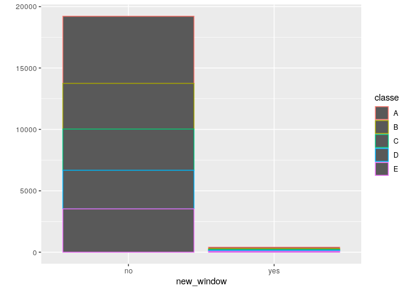
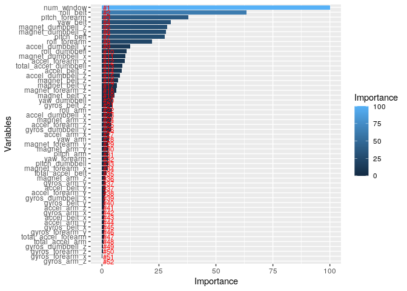

# Introduction
In this report, a Machine Learning model would be built on a dataset. The dataset is retrieved a group of enthusiasts who take measurements about themselves regularly. In this project, the goal will be to use data from accelerometers on the belt, forearm, arm, and dumbell of 6 participants. More information is available from the website here: <http://web.archive.org/web/20161224072740/http:/groupware.les.inf.puc-rio.br/har>


# Getting Data
To begin, i will load my required packages. 

```r
library(lattice)
library(ggplot2)
library(dplyr)
```

```
## 
## Attaching package: 'dplyr'
```

```
## The following objects are masked from 'package:stats':
## 
##     filter, lag
```

```
## The following objects are masked from 'package:base':
## 
##     intersect, setdiff, setequal, union
```

```r
library(caret)
```
Note: You may need to install some of them.

```r
if(!file.exists('data/pml-training.csv')){
        download.file('https://d396qusza40orc.cloudfront.net/predmachlearn/pml-training.csv',destfile = 'data/pml-training.csv')
}
if(!file.exists('data/pml-testing.csv')){
        download.file('https://d396qusza40orc.cloudfront.net/predmachlearn/pml-testing.csv',destfile = 'data/pml-testing.csv')
}
train <- read.csv('data/pml-training.csv', na.strings = c(NA,"","#DIV/0!"))
test  <- read.csv('data/pml-testing.csv', na.strings = c(NA,"","#DIV/0!"))
```

# Exploratiory Data Analysis

```r
dim(train)
```

```
## [1] 19622   160
```
The total possible predictors are 160. We would explore to see what each field contains

```r
str(train)
```

```
## 'data.frame':	19622 obs. of  160 variables:
##  $ X                       : int  1 2 3 4 5 6 7 8 9 10 ...
##  $ user_name               : Factor w/ 6 levels "adelmo","carlitos",..: 2 2 2 2 2 2 2 2 2 2 ...
##  $ raw_timestamp_part_1    : int  1323084231 1323084231 1323084231 1323084232 1323084232 1323084232 1323084232 1323084232 1323084232 1323084232 ...
##  $ raw_timestamp_part_2    : int  788290 808298 820366 120339 196328 304277 368296 440390 484323 484434 ...
##  $ cvtd_timestamp          : Factor w/ 20 levels "02/12/2011 13:32",..: 9 9 9 9 9 9 9 9 9 9 ...
##  $ new_window              : Factor w/ 2 levels "no","yes": 1 1 1 1 1 1 1 1 1 1 ...
##  $ num_window              : int  11 11 11 12 12 12 12 12 12 12 ...
##  $ roll_belt               : num  1.41 1.41 1.42 1.48 1.48 1.45 1.42 1.42 1.43 1.45 ...
##  $ pitch_belt              : num  8.07 8.07 8.07 8.05 8.07 8.06 8.09 8.13 8.16 8.17 ...
##  $ yaw_belt                : num  -94.4 -94.4 -94.4 -94.4 -94.4 -94.4 -94.4 -94.4 -94.4 -94.4 ...
##  $ total_accel_belt        : int  3 3 3 3 3 3 3 3 3 3 ...
##  $ kurtosis_roll_belt      : num  NA NA NA NA NA NA NA NA NA NA ...
##  $ kurtosis_picth_belt     : num  NA NA NA NA NA NA NA NA NA NA ...
##  $ kurtosis_yaw_belt       : logi  NA NA NA NA NA NA ...
##  $ skewness_roll_belt      : num  NA NA NA NA NA NA NA NA NA NA ...
##  $ skewness_roll_belt.1    : num  NA NA NA NA NA NA NA NA NA NA ...
##  $ skewness_yaw_belt       : logi  NA NA NA NA NA NA ...
##  $ max_roll_belt           : num  NA NA NA NA NA NA NA NA NA NA ...
##  $ max_picth_belt          : int  NA NA NA NA NA NA NA NA NA NA ...
##  $ max_yaw_belt            : num  NA NA NA NA NA NA NA NA NA NA ...
##  $ min_roll_belt           : num  NA NA NA NA NA NA NA NA NA NA ...
##  $ min_pitch_belt          : int  NA NA NA NA NA NA NA NA NA NA ...
##  $ min_yaw_belt            : num  NA NA NA NA NA NA NA NA NA NA ...
##  $ amplitude_roll_belt     : num  NA NA NA NA NA NA NA NA NA NA ...
##  $ amplitude_pitch_belt    : int  NA NA NA NA NA NA NA NA NA NA ...
##  $ amplitude_yaw_belt      : num  NA NA NA NA NA NA NA NA NA NA ...
##  $ var_total_accel_belt    : num  NA NA NA NA NA NA NA NA NA NA ...
##  $ avg_roll_belt           : num  NA NA NA NA NA NA NA NA NA NA ...
##  $ stddev_roll_belt        : num  NA NA NA NA NA NA NA NA NA NA ...
##  $ var_roll_belt           : num  NA NA NA NA NA NA NA NA NA NA ...
##  $ avg_pitch_belt          : num  NA NA NA NA NA NA NA NA NA NA ...
##  $ stddev_pitch_belt       : num  NA NA NA NA NA NA NA NA NA NA ...
##  $ var_pitch_belt          : num  NA NA NA NA NA NA NA NA NA NA ...
##  $ avg_yaw_belt            : num  NA NA NA NA NA NA NA NA NA NA ...
##  $ stddev_yaw_belt         : num  NA NA NA NA NA NA NA NA NA NA ...
##  $ var_yaw_belt            : num  NA NA NA NA NA NA NA NA NA NA ...
##  $ gyros_belt_x            : num  0 0.02 0 0.02 0.02 0.02 0.02 0.02 0.02 0.03 ...
##  $ gyros_belt_y            : num  0 0 0 0 0.02 0 0 0 0 0 ...
##  $ gyros_belt_z            : num  -0.02 -0.02 -0.02 -0.03 -0.02 -0.02 -0.02 -0.02 -0.02 0 ...
##  $ accel_belt_x            : int  -21 -22 -20 -22 -21 -21 -22 -22 -20 -21 ...
##  $ accel_belt_y            : int  4 4 5 3 2 4 3 4 2 4 ...
##  $ accel_belt_z            : int  22 22 23 21 24 21 21 21 24 22 ...
##  $ magnet_belt_x           : int  -3 -7 -2 -6 -6 0 -4 -2 1 -3 ...
##  $ magnet_belt_y           : int  599 608 600 604 600 603 599 603 602 609 ...
##  $ magnet_belt_z           : int  -313 -311 -305 -310 -302 -312 -311 -313 -312 -308 ...
##  $ roll_arm                : num  -128 -128 -128 -128 -128 -128 -128 -128 -128 -128 ...
##  $ pitch_arm               : num  22.5 22.5 22.5 22.1 22.1 22 21.9 21.8 21.7 21.6 ...
##  $ yaw_arm                 : num  -161 -161 -161 -161 -161 -161 -161 -161 -161 -161 ...
##  $ total_accel_arm         : int  34 34 34 34 34 34 34 34 34 34 ...
##  $ var_accel_arm           : num  NA NA NA NA NA NA NA NA NA NA ...
##  $ avg_roll_arm            : num  NA NA NA NA NA NA NA NA NA NA ...
##  $ stddev_roll_arm         : num  NA NA NA NA NA NA NA NA NA NA ...
##  $ var_roll_arm            : num  NA NA NA NA NA NA NA NA NA NA ...
##  $ avg_pitch_arm           : num  NA NA NA NA NA NA NA NA NA NA ...
##  $ stddev_pitch_arm        : num  NA NA NA NA NA NA NA NA NA NA ...
##  $ var_pitch_arm           : num  NA NA NA NA NA NA NA NA NA NA ...
##  $ avg_yaw_arm             : num  NA NA NA NA NA NA NA NA NA NA ...
##  $ stddev_yaw_arm          : num  NA NA NA NA NA NA NA NA NA NA ...
##  $ var_yaw_arm             : num  NA NA NA NA NA NA NA NA NA NA ...
##  $ gyros_arm_x             : num  0 0.02 0.02 0.02 0 0.02 0 0.02 0.02 0.02 ...
##  $ gyros_arm_y             : num  0 -0.02 -0.02 -0.03 -0.03 -0.03 -0.03 -0.02 -0.03 -0.03 ...
##  $ gyros_arm_z             : num  -0.02 -0.02 -0.02 0.02 0 0 0 0 -0.02 -0.02 ...
##  $ accel_arm_x             : int  -288 -290 -289 -289 -289 -289 -289 -289 -288 -288 ...
##  $ accel_arm_y             : int  109 110 110 111 111 111 111 111 109 110 ...
##  $ accel_arm_z             : int  -123 -125 -126 -123 -123 -122 -125 -124 -122 -124 ...
##  $ magnet_arm_x            : int  -368 -369 -368 -372 -374 -369 -373 -372 -369 -376 ...
##  $ magnet_arm_y            : int  337 337 344 344 337 342 336 338 341 334 ...
##  $ magnet_arm_z            : int  516 513 513 512 506 513 509 510 518 516 ...
##  $ kurtosis_roll_arm       : num  NA NA NA NA NA NA NA NA NA NA ...
##  $ kurtosis_picth_arm      : num  NA NA NA NA NA NA NA NA NA NA ...
##  $ kurtosis_yaw_arm        : num  NA NA NA NA NA NA NA NA NA NA ...
##  $ skewness_roll_arm       : num  NA NA NA NA NA NA NA NA NA NA ...
##  $ skewness_pitch_arm      : num  NA NA NA NA NA NA NA NA NA NA ...
##  $ skewness_yaw_arm        : num  NA NA NA NA NA NA NA NA NA NA ...
##  $ max_roll_arm            : num  NA NA NA NA NA NA NA NA NA NA ...
##  $ max_picth_arm           : num  NA NA NA NA NA NA NA NA NA NA ...
##  $ max_yaw_arm             : int  NA NA NA NA NA NA NA NA NA NA ...
##  $ min_roll_arm            : num  NA NA NA NA NA NA NA NA NA NA ...
##  $ min_pitch_arm           : num  NA NA NA NA NA NA NA NA NA NA ...
##  $ min_yaw_arm             : int  NA NA NA NA NA NA NA NA NA NA ...
##  $ amplitude_roll_arm      : num  NA NA NA NA NA NA NA NA NA NA ...
##  $ amplitude_pitch_arm     : num  NA NA NA NA NA NA NA NA NA NA ...
##  $ amplitude_yaw_arm       : int  NA NA NA NA NA NA NA NA NA NA ...
##  $ roll_dumbbell           : num  13.1 13.1 12.9 13.4 13.4 ...
##  $ pitch_dumbbell          : num  -70.5 -70.6 -70.3 -70.4 -70.4 ...
##  $ yaw_dumbbell            : num  -84.9 -84.7 -85.1 -84.9 -84.9 ...
##  $ kurtosis_roll_dumbbell  : num  NA NA NA NA NA NA NA NA NA NA ...
##  $ kurtosis_picth_dumbbell : num  NA NA NA NA NA NA NA NA NA NA ...
##  $ kurtosis_yaw_dumbbell   : logi  NA NA NA NA NA NA ...
##  $ skewness_roll_dumbbell  : num  NA NA NA NA NA NA NA NA NA NA ...
##  $ skewness_pitch_dumbbell : num  NA NA NA NA NA NA NA NA NA NA ...
##  $ skewness_yaw_dumbbell   : logi  NA NA NA NA NA NA ...
##  $ max_roll_dumbbell       : num  NA NA NA NA NA NA NA NA NA NA ...
##  $ max_picth_dumbbell      : num  NA NA NA NA NA NA NA NA NA NA ...
##  $ max_yaw_dumbbell        : num  NA NA NA NA NA NA NA NA NA NA ...
##  $ min_roll_dumbbell       : num  NA NA NA NA NA NA NA NA NA NA ...
##  $ min_pitch_dumbbell      : num  NA NA NA NA NA NA NA NA NA NA ...
##  $ min_yaw_dumbbell        : num  NA NA NA NA NA NA NA NA NA NA ...
##  $ amplitude_roll_dumbbell : num  NA NA NA NA NA NA NA NA NA NA ...
##   [list output truncated]
```

Count number of conplete and non complete columns in terms of percentage completeness

```r
table(paste0(round(100*sapply(train, function(x) sum(!is.na(x)))/nrow(train)),'%'))
```

```
## 
##   0% 100%   2% 
##    6   60   94
```
Only these 60 predictors would be considered.

Let's explore the Factors since they are few

```r
sapply(train[,sapply(train, function(x) is.factor(x))], function(x) levels(x))
```

```
## $user_name
## [1] "adelmo"   "carlitos" "charles"  "eurico"   "jeremy"   "pedro"   
## 
## $cvtd_timestamp
##  [1] "02/12/2011 13:32" "02/12/2011 13:33" "02/12/2011 13:34" "02/12/2011 13:35"
##  [5] "02/12/2011 14:56" "02/12/2011 14:57" "02/12/2011 14:58" "02/12/2011 14:59"
##  [9] "05/12/2011 11:23" "05/12/2011 11:24" "05/12/2011 11:25" "05/12/2011 14:22"
## [13] "05/12/2011 14:23" "05/12/2011 14:24" "28/11/2011 14:13" "28/11/2011 14:14"
## [17] "28/11/2011 14:15" "30/11/2011 17:10" "30/11/2011 17:11" "30/11/2011 17:12"
## 
## $new_window
## [1] "no"  "yes"
## 
## $classe
## [1] "A" "B" "C" "D" "E"
```
The user_name and *_timeastamp aren't particularly useful in prediction.
Let's compare the new_window and classe

```r
qplot(x=new_window, color=classe, data = train)
```

<!-- -->
Values are almost similar. Meaning it has near zero variance.
There fore we ignore all factor variables.
We can notice that two more timeframe columns exist with would be of little importanct. And also the index column
Luckily, all the columns we don't need exist in the first six columns

# Cleaning and Predictor Selection
Before we start, the train data set would be partitioned so we can do use some for testong and validation.

```r
set.seed(2020-07-07)
inTrain <- createDataPartition(y=train$classe,p=0.7, list=FALSE)
train.training <- train[inTrain,]
train.testing <- train[-inTrain,]

train.new_training <-train.training[,(round(100*sapply(train.training, function(x) sum(!is.na(x)))/nrow(train.training))>10)]
str(train.new_training)
```

```
## 'data.frame':	13737 obs. of  60 variables:
##  $ X                   : int  1 2 3 5 6 8 9 11 12 14 ...
##  $ user_name           : Factor w/ 6 levels "adelmo","carlitos",..: 2 2 2 2 2 2 2 2 2 2 ...
##  $ raw_timestamp_part_1: int  1323084231 1323084231 1323084231 1323084232 1323084232 1323084232 1323084232 1323084232 1323084232 1323084232 ...
##  $ raw_timestamp_part_2: int  788290 808298 820366 196328 304277 440390 484323 500302 528316 576390 ...
##  $ cvtd_timestamp      : Factor w/ 20 levels "02/12/2011 13:32",..: 9 9 9 9 9 9 9 9 9 9 ...
##  $ new_window          : Factor w/ 2 levels "no","yes": 1 1 1 1 1 1 1 1 1 1 ...
##  $ num_window          : int  11 11 11 12 12 12 12 12 12 12 ...
##  $ roll_belt           : num  1.41 1.41 1.42 1.48 1.45 1.42 1.43 1.45 1.43 1.42 ...
##  $ pitch_belt          : num  8.07 8.07 8.07 8.07 8.06 8.13 8.16 8.18 8.18 8.21 ...
##  $ yaw_belt            : num  -94.4 -94.4 -94.4 -94.4 -94.4 -94.4 -94.4 -94.4 -94.4 -94.4 ...
##  $ total_accel_belt    : int  3 3 3 3 3 3 3 3 3 3 ...
##  $ gyros_belt_x        : num  0 0.02 0 0.02 0.02 0.02 0.02 0.03 0.02 0.02 ...
##  $ gyros_belt_y        : num  0 0 0 0.02 0 0 0 0 0 0 ...
##  $ gyros_belt_z        : num  -0.02 -0.02 -0.02 -0.02 -0.02 -0.02 -0.02 -0.02 -0.02 -0.02 ...
##  $ accel_belt_x        : int  -21 -22 -20 -21 -21 -22 -20 -21 -22 -22 ...
##  $ accel_belt_y        : int  4 4 5 2 4 4 2 2 2 4 ...
##  $ accel_belt_z        : int  22 22 23 24 21 21 24 23 23 21 ...
##  $ magnet_belt_x       : int  -3 -7 -2 -6 0 -2 1 -5 -2 -8 ...
##  $ magnet_belt_y       : int  599 608 600 600 603 603 602 596 602 598 ...
##  $ magnet_belt_z       : int  -313 -311 -305 -302 -312 -313 -312 -317 -319 -310 ...
##  $ roll_arm            : num  -128 -128 -128 -128 -128 -128 -128 -128 -128 -128 ...
##  $ pitch_arm           : num  22.5 22.5 22.5 22.1 22 21.8 21.7 21.5 21.5 21.4 ...
##  $ yaw_arm             : num  -161 -161 -161 -161 -161 -161 -161 -161 -161 -161 ...
##  $ total_accel_arm     : int  34 34 34 34 34 34 34 34 34 34 ...
##  $ gyros_arm_x         : num  0 0.02 0.02 0 0.02 0.02 0.02 0.02 0.02 0.02 ...
##  $ gyros_arm_y         : num  0 -0.02 -0.02 -0.03 -0.03 -0.02 -0.03 -0.03 -0.03 0 ...
##  $ gyros_arm_z         : num  -0.02 -0.02 -0.02 0 0 0 -0.02 0 0 -0.03 ...
##  $ accel_arm_x         : int  -288 -290 -289 -289 -289 -289 -288 -290 -288 -288 ...
##  $ accel_arm_y         : int  109 110 110 111 111 111 109 110 111 111 ...
##  $ accel_arm_z         : int  -123 -125 -126 -123 -122 -124 -122 -123 -123 -124 ...
##  $ magnet_arm_x        : int  -368 -369 -368 -374 -369 -372 -369 -366 -363 -371 ...
##  $ magnet_arm_y        : int  337 337 344 337 342 338 341 339 343 331 ...
##  $ magnet_arm_z        : int  516 513 513 506 513 510 518 509 520 523 ...
##  $ roll_dumbbell       : num  13.1 13.1 12.9 13.4 13.4 ...
##  $ pitch_dumbbell      : num  -70.5 -70.6 -70.3 -70.4 -70.8 ...
##  $ yaw_dumbbell        : num  -84.9 -84.7 -85.1 -84.9 -84.5 ...
##  $ total_accel_dumbbell: int  37 37 37 37 37 37 37 37 37 37 ...
##  $ gyros_dumbbell_x    : num  0 0 0 0 0 0 0 0 0 0.02 ...
##  $ gyros_dumbbell_y    : num  -0.02 -0.02 -0.02 -0.02 -0.02 -0.02 -0.02 -0.02 -0.02 -0.02 ...
##  $ gyros_dumbbell_z    : num  0 0 0 0 0 0 0 0 0 -0.02 ...
##  $ accel_dumbbell_x    : int  -234 -233 -232 -233 -234 -234 -232 -233 -233 -234 ...
##  $ accel_dumbbell_y    : int  47 47 46 48 48 46 47 47 47 48 ...
##  $ accel_dumbbell_z    : int  -271 -269 -270 -270 -269 -272 -269 -269 -270 -268 ...
##  $ magnet_dumbbell_x   : int  -559 -555 -561 -554 -558 -555 -549 -564 -554 -554 ...
##  $ magnet_dumbbell_y   : int  293 296 298 292 294 300 292 299 291 295 ...
##  $ magnet_dumbbell_z   : num  -65 -64 -63 -68 -66 -74 -65 -64 -65 -68 ...
##  $ roll_forearm        : num  28.4 28.3 28.3 28 27.9 27.8 27.7 27.6 27.5 27.2 ...
##  $ pitch_forearm       : num  -63.9 -63.9 -63.9 -63.9 -63.9 -63.8 -63.8 -63.8 -63.8 -63.9 ...
##  $ yaw_forearm         : num  -153 -153 -152 -152 -152 -152 -152 -152 -152 -151 ...
##  $ total_accel_forearm : int  36 36 36 36 36 36 36 36 36 36 ...
##  $ gyros_forearm_x     : num  0.03 0.02 0.03 0.02 0.02 0.02 0.03 0.02 0.02 0 ...
##  $ gyros_forearm_y     : num  0 0 -0.02 0 -0.02 -0.02 0 -0.02 0.02 -0.02 ...
##  $ gyros_forearm_z     : num  -0.02 -0.02 0 -0.02 -0.03 0 -0.02 -0.02 -0.03 -0.03 ...
##  $ accel_forearm_x     : int  192 192 196 189 193 193 193 193 191 193 ...
##  $ accel_forearm_y     : int  203 203 204 206 203 205 204 205 203 202 ...
##  $ accel_forearm_z     : int  -215 -216 -213 -214 -215 -213 -214 -214 -215 -214 ...
##  $ magnet_forearm_x    : int  -17 -18 -18 -17 -9 -9 -16 -17 -11 -14 ...
##  $ magnet_forearm_y    : num  654 661 658 655 660 660 653 657 657 659 ...
##  $ magnet_forearm_z    : num  476 473 469 473 478 474 476 465 478 478 ...
##  $ classe              : Factor w/ 5 levels "A","B","C","D",..: 1 1 1 1 1 1 1 1 1 1 ...
```

```r
train.new_training_model <- train.new_training[,-c(1:6)]
```

# Model Building
We build the model with all other predictors against classe. 
The randorm forest method is used with 3 number of folds for cross validation

```r
fit <- train( classe ~ .,
              data = train.new_training_model,
              method = 'rf',
              trControl = trainControl( number = 3,
                                        method = 'cv',
                                        verboseIter = FALSE
                                        )
              )
```
The importance of the predictors is shown here. We could use only the top predictors for reducing overfitting and scaling purposes.

```r
importance    <- varImp(fit)$importance
predictors <- row.names(importance)
varImportance <- data.frame(Variables = predictors, 
                            Importance = round(importance$Overall,2))

# Create a rank variable based on importance
rankImportance <- varImportance %>%
  mutate(Rank = paste0('#',dense_rank(desc(Importance))))

# Use ggplot2 to visualize the relative importance of variables
ggplot(rankImportance, aes(x = reorder(Variables, Importance), 
    y = Importance, fill = Importance)) +
  geom_bar(stat='identity') + 
  geom_text(aes(x = Variables, y = 0.5, label = Rank),
    hjust=0, vjust=0.55, size = 3, colour = 'red') +
  labs(x = 'Variables') +
  coord_flip()
```

<!-- -->

Now we look at the out of sample error.

```r
confusionMatrix(train.testing$classe,predict(fit,train.testing))$table
```

```
##           Reference
## Prediction    A    B    C    D    E
##          A 1674    0    0    0    0
##          B    1 1138    0    0    0
##          C    0    0 1026    0    0
##          D    0    0    3  961    0
##          E    0    0    0    0 1082
```
The errors are low.
Looking at the accuracy value can confirm

```r
confusionMatrix(train.testing$classe,predict(fit,train.testing))$overall[1]
```

```
##  Accuracy 
## 0.9993203
```

# Final Model 
These are models that would be used

```r
predictors[1:25]
```

```
##  [1] "num_window"       "roll_belt"        "pitch_belt"       "yaw_belt"        
##  [5] "total_accel_belt" "gyros_belt_x"     "gyros_belt_y"     "gyros_belt_z"    
##  [9] "accel_belt_x"     "accel_belt_y"     "accel_belt_z"     "magnet_belt_x"   
## [13] "magnet_belt_y"    "magnet_belt_z"    "roll_arm"         "pitch_arm"       
## [17] "yaw_arm"          "total_accel_arm"  "gyros_arm_x"      "gyros_arm_y"     
## [21] "gyros_arm_z"      "accel_arm_x"      "accel_arm_y"      "accel_arm_z"     
## [25] "magnet_arm_x"
```


```r
fit <- train( as.formula( paste("classe", paste( predictors[1:25], collapse = ' + '), sep = ' ~ ')),
              data = train,
              method = 'rf',
              trControl = trainControl( number = 3,
                                        method = 'cv',
                                        verboseIter = FALSE
              )
)
predictions <- predict(fit,test)
predictions
```

```
##  [1] B A B A A E D B A A B C B A E E A B B B
## Levels: A B C D E
```

# Why you made the choices you did
The reduced number of predictors to reduce the chances of overfitting and increase performance.
